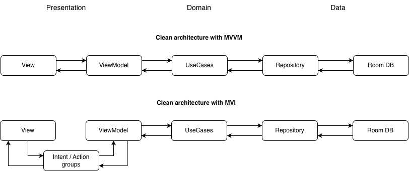

## SugarCounter

v1.3.4_47

This is a test app within a real-scenario environment by having the app available in the Google Play
Store.
The idea is simple: Tracking one’s sugar consumption locally on a device in a list-like manner.
The accuracy of sugar tracking is deliberately left to the user of the app.

Initially the test app was created to try out Jetpack Compose in a broader way.
Over time it evolved to a test app in general.

**Technology Stack**

* Jetpack Compose
* Room database with migration scenarios
* Navigation
* Worker
* Dependency Injection with Koin
* CI/CD with Gitlab pipelines

**Architecture**

Besides pattern implementations of e.g. workers the app uses two main architecture models:

**Privacy Policy**

The privacy policy page of this app is stored here:
https://sites.google.com/view/sugarcounter-privacypolicy
It is located on the 'Google Sites' platform of the account 'jumparoundcreations@gmail.com'.

